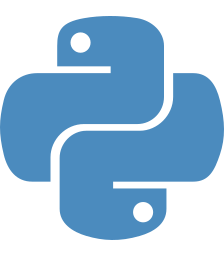

<!-- README.md is generated from README.Rmd. Please edit that file -->

# 📢 Hi there 👋 I’m Tim!

<!-- badges: start -->

<!-- badges: end -->

- 🔨 I’m currently working on the next version of the
  [loopurrr](https://github.com/TimTeaFan/loopurrr/) package 📦
- 📚 I’m currently learning JavasScript 
- 🤔 I’m still looking for help with [this shiny
  question](https://stackoverflow.com/questions/59382931/embed-an-external-shiny-app-in-another-vanilla-shiny-app)
  
- 💬 Ask me about , Python  and Data Sience
- 🔗 Visit my website at: <https://tim-tiefenbach.de/>
- 📢 Have a look at my repositories below ⬇️

  ⬜ 🟩 ⬜ ⬜ ⬜ in case my contributions  ⬜ ⬜ ⬜ ⬜ 🟩 show a
lot of inactivity:  ⬜ ⬜ ⬜ ⬜ ⬜ Note, I often avoid working  ⬜
⬜ ⬜ 🟩 ⬜ on the main branches 😅
